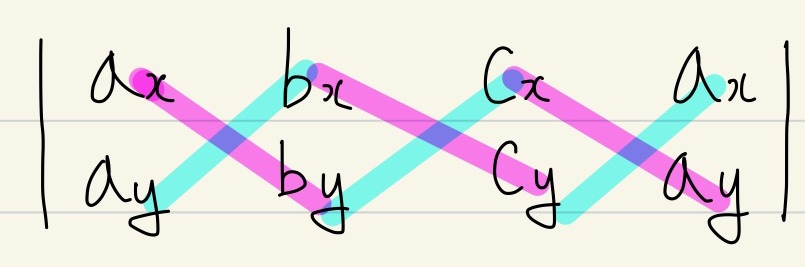
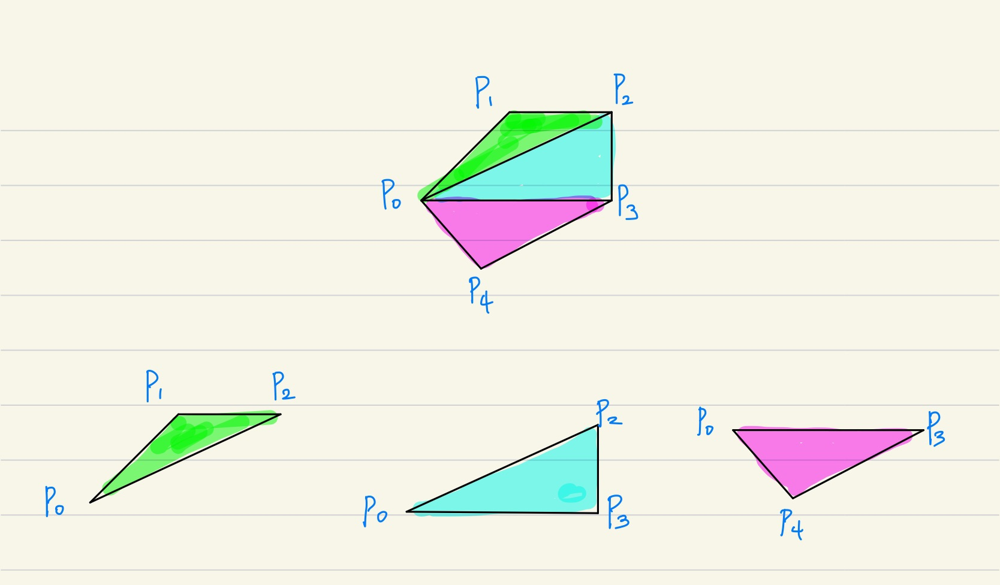
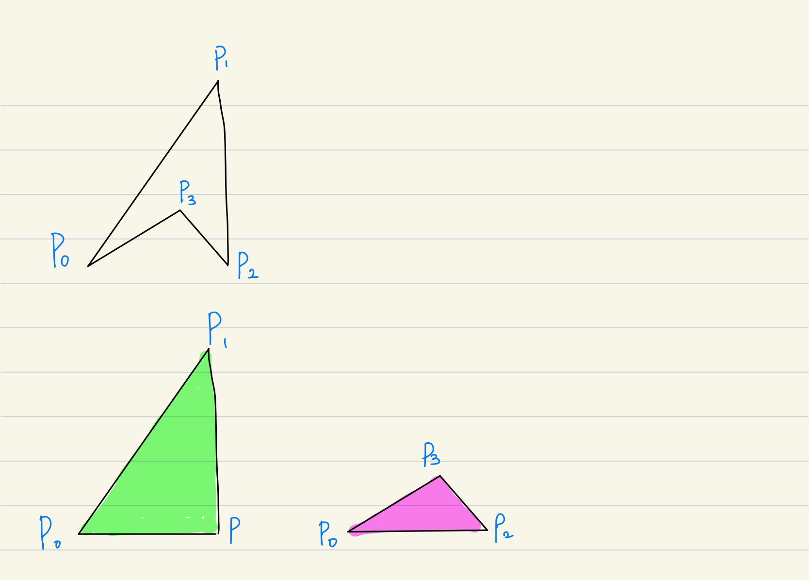

# 다각형의 면적

[문제 링크](https://www.acmicpc.net/problem/2166)

## 문제를 푸는 데 필요한 배경지식

<br />

### 1. 세 점이 이루는 삼각형의 넓이

점 A, B, C가 이루는 삼각형의 넓이는 AB벡터와 AC벡터의 외적을 통해 구할 수 있습니다.

AB벡터와 AC벡터의 외적의 크기는 AB벡터의 AC벡터를 두 변으로 하는 평행 사변형의 넓이와 같으므로,

외적 크기 / 2를 통해 삼각형의 넓이를 구할 수 있습니다.

<br />

### 2. 두 벡터의 외적

두 벡터의 외적의 크기는 흔히 신발끈 공식이라고 알려져있는 공식을 통해서 구할 수 있습니다.

$A = (a_x, a_y, 0)$

$B = (b_x, b_y, 0)$

$C = (c_x, c_y, 0)$

한 평면 위의 세 개의 점 A B C가 위와 같이 정의될 때, AB벡터와 AC벡터의 외적은 아래와 같이 구할 수 있습니다.



붉은색으로 표시된 요소끼리는 곱해서 더하고,  
파란색으로 표시된 요소끼리는 곱해서 빼면 아래와 같은 결과가 됩니다.

$\vec{AB}\times\vec{AC} = a_x * b_y + b_x * c_y + c_x * a_y - b_x * a_y - c_x * b_y - a_x * c_y$

<br />

### 3. 외적의 오른손 법칙

$\vec{AB}\times\vec{AC}$의 결과가 양(+)라면, 세 점 A B C는 순서대로 반시계 방향으로 위치해 있습니다.

반대로 외적의 결과가 음(-)이라면, 세 점 A B C는 순서대로 시계 방향으로 위치해 있습니다.

<br />

### 4. cout 소수점 자리수 고정

cout을 통해 실수 자료형을 출력하면, 출력되는 소수의 자리수가 정수 부분이 포함되어 6자리로 출력되므로, 출력되는 소수의 자리수가 일정하지 않습니다.

보통 PS에서는 소수 n번째 자리에서 반올림하여 출력을 요구하는 문제가 많은데, 이 때 cout을 그대로 사용하면 소수점 자리수가 맞지 않아 틀리게 됩니다.

이를 위해 cout이 실수 자료형을 출력할 때

1. 정수 부분은 제외하고 소수 부분만 자리수로 계산하도록 설정
2. 자리수를 원하는 숫자로 설정

위 두 가지 설정이 필요합니다.

먼저, 1)에 해당하는 명령어는 `cout.setf(ios::fixed);`입니다.

$A = 123.45678910$일 때, A의 값을 cout을 통해 출력하면

```CPP
// cout의 기본 자릿수는 6으로 설정되어 있습니다.
cout << A;
// 123.456 출력
// 정수부분 + 소수부분의 자리수 = 6
```

위와 같은 결과를 얻을 수 있습니다.
이 때, `cout.setf(ios::fixed);`를 사용하면

```CPP
cout.setf(ios::fixed);
cout << A;
// 123.456789 출력
// 소수부분의 자리수 = 6
```

위 처럼 소수 부분의 자리수가 6(기본값)으로 고정된 것을 확인할 수 있습니다.

이제, 문제에서 요구하는대로 소수점 아래 2번째 자리에서 반올림 한 결과를 출력하고 싶다면, `cout.precision(2);` 명령어를 사용합니다.

기본값이 6으로 설정된 cout의 자릿수를, 원하는 숫자로 바꾸는 명령어 입니다.

```CPP
cout.precision(2);
cout << A;
// 123.46 출력
```

<br />
<br />

## 문제 풀이

3개 이상의 점들이 다각형을 이루는 순서대로 입력으로 주어집니다.

N개의 점들($P_0...P_{n-1}$)이 이루는 다각형이 볼록 다각형인 경우,

i 번째 점을 입력 받을 때
$\vec{P_0P_{i-1}}\times\vec{P_0P_{i}}$를 계산하여 세 점 $P_0, P_{i-1}, P_{i}$가 이루는 삼각형의 면적을 다 더해주면 다각형의 면적이 됩니다.



만약 N개의 점들이 이루는 다각형이 볼록 다각형이 아닌 경우, 볼록껍질에 포함되지 않는 점이 입력으로 들어왔을 때 $\vec{P_0P_{i-1}}\times\vec{P_0P_{i}}$를 계산해보면, 볼록껍질에 포함되는 점에 대한 외적 결과값과는 부호가 반대가 되는 것을 확인할 수 있습니다.  
볼록껍질에 포함되지 않는 점$P_i$가 시작점과 $P_{i-1}$과 이루는 삼각형은 다각형의 면적을 구할 때 더해지는 것이 아니라, -로 빼줘야 다각형의 면적을 구할 수 있습니다.

아래 그림의 경우, 초록색 면적은 더하고, 붉은색 면적을 빼면 전체 다각형의 넓이를 구할 수 있습니다.



위 두가지 경우를 모두 고려하기 위해, 삼각형의 넓이를 구할 때 사용하는 외적의 결과값에 절대값을 취하지 않고, 모두 더한 뒤에, 마지막에만 절대값을 취해주면 답을 구할 수 있습니다.

절대값을 취해야 하는 이유는, 입력이 다각형의 시작점을 기준으로 시계 방향으로 들어올 지, 반시계 방향으로 들어올 지 알 수 없기 때문입니다.

풀이 코드

```CPP
#include <bits/stdc++.h>
#define INF 999999999999
typedef long long ll;
using namespace std;

ll n;
double area;

struct Point {
  ll x;
  ll y;
};

double cross_product(Point a, Point b, Point c) {
  return a.x * b.y + b.x * c.y + c.x * a.y - b.x * a.y - c.x * b.y - a.x * c.y;
}

int main() {
  ios_base::sync_with_stdio(false);
  cin.tie(0);

  cout.setf(ios::fixed);
  // cout.precision(1);

  cin >> n;

  Point start, last, now;
  cin >> start.x >> start.y;
  cin >> last.x >> last.y;

  for(ll i = 2; i < n; i++) {
    cin >> now.x >> now.y;
    area += cross_product(start, last, now) / 2;
    last = now;
  }
  cout << abs(area);

  return 0;
}
```
